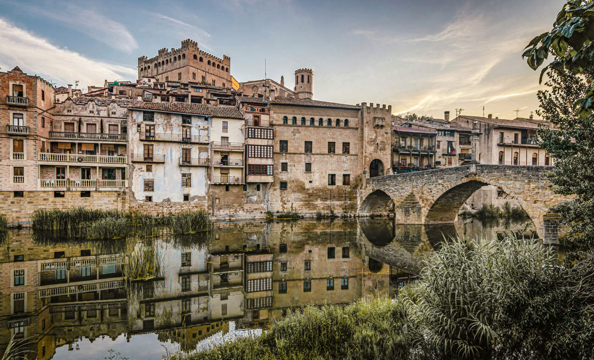

# Mi página de imágenes y viaje

¡Bienvenidos a mi página! Aquí podrás ver algunas fotos que representan mi pueblo, mis viajes y mis intereses.

## 1. **Valderrobres** (Mi pueblo)
Valderrobres es un hermoso pueblo ubicado en la provincia de Teruel, en la región de Aragón, España. Su arquitectura medieval y su río Matarraña lo hacen un lugar único.

## 2. **Viaje a Biella**
Hace poco realicé un viaje a Biella, una ciudad en el norte de Italia, famosa por su rica historia y hermosos paisajes. Fue una experiencia increíble.

## 3. **Interés en Brockhampton**
Brockhampton es un colectivo musical que ha influido mucho en mi vida. Su estilo único y su energía creativa me han inspirado profundamente.

---

Gracias por visitar mi pagina. ¡Espero que disfrutes las imágenes!